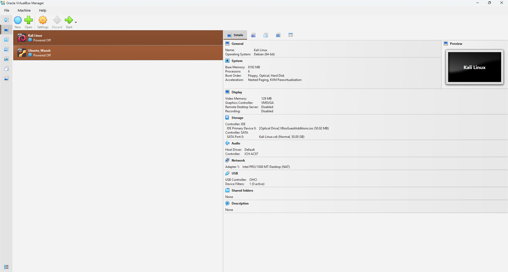
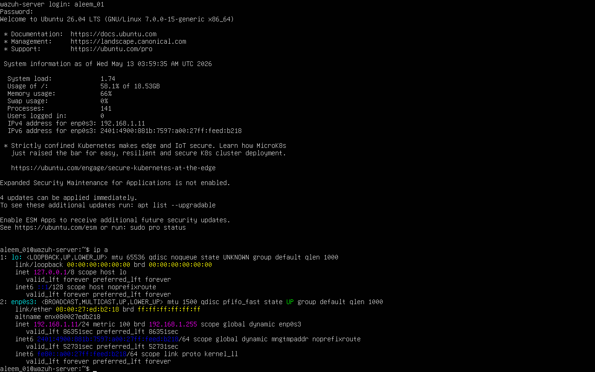
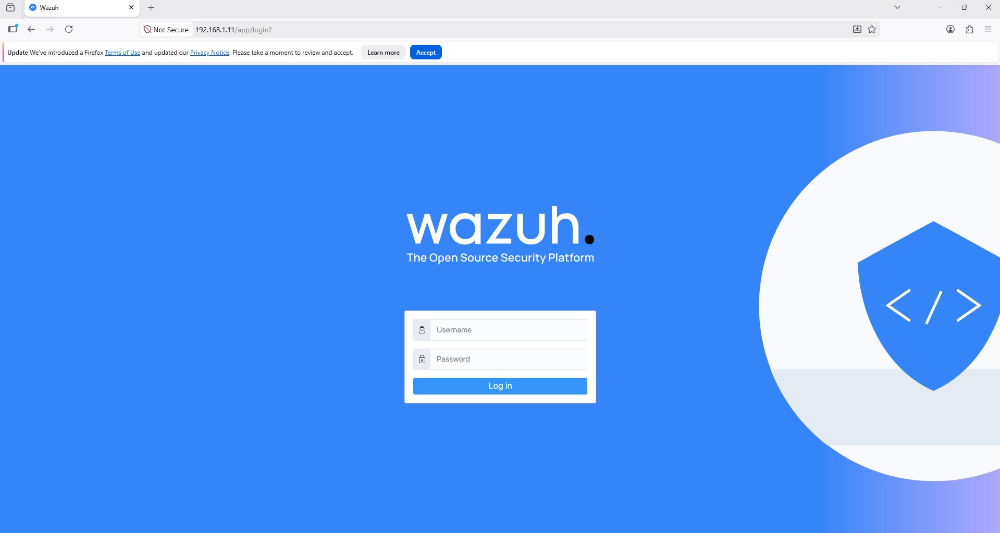
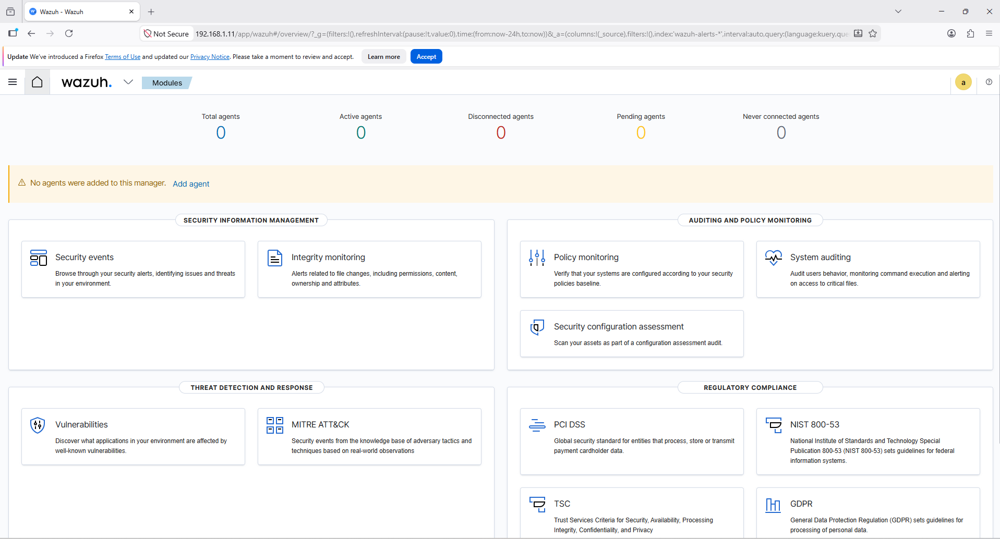
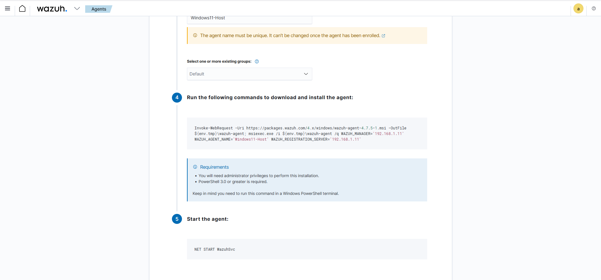
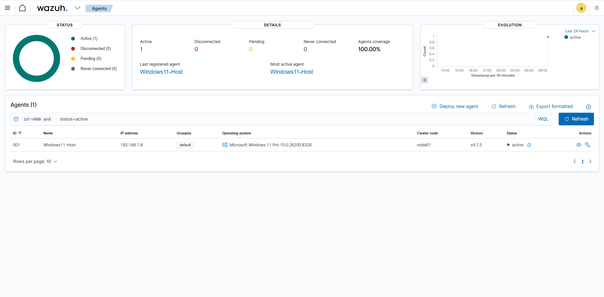
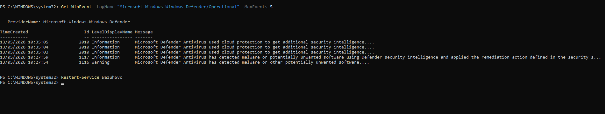
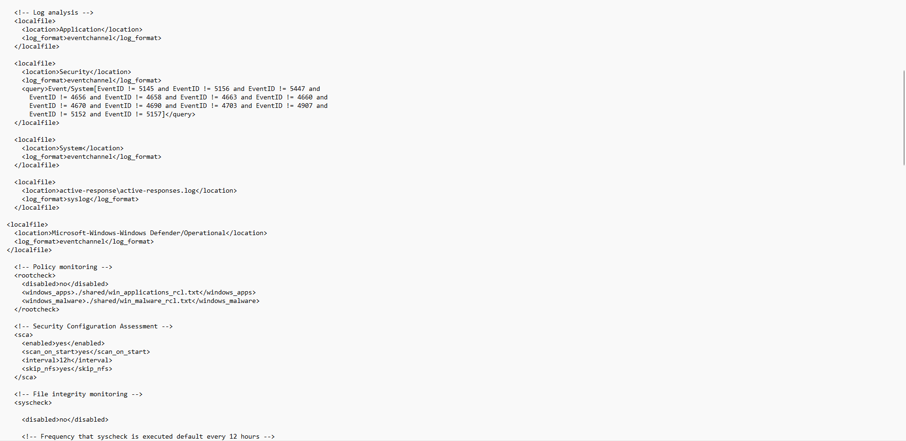

# Beginner-SOC-Lab-Wazuh

Beginner SOC Lab using Wazuh SIEM, Windows 11, Ubuntu Server, and VirtualBox.

## Components Used
- Windows 11 Host
- Ubuntu Server (Wazuh SIEM)
- VirtualBox Lab Environment

## Purpose
Learning SOC operations, log monitoring, alerting, and threat detection.

## Lab Setup
| Component | Purpose |
|-----------|----------|
| Windows 11 | Endpoint machine |
| Ubuntu Server | Wazuh SIEM server |
| VirtualBox | Virtual lab environment |

## Features Demonstrated
- Wazuh agent deployment
- Windows Defender malware detection
- Security event monitoring
- Failed login detection
- Log collection using Wazuh

## What I Learned
- Wazuh agent deployment
- Windows event monitoring
- Malware alert detection
- Basic SOC workflow
- Log analysis

## Tools Used
- Wazuh SIEM
- Windows Defender
- PowerShell
- Ubuntu Server
- VirtualBox

## Screenshots

## Screenshots

### VirtualBox Dashboard

### VirtualBox Ubuntu Wazuh Setup

### Wazuh Login Page

### Wazuh Dashboard

### Agent Deployment Command

### Agent Active Status

### Failed Login Detection

### Malware Detection Alert

### PowerShell Defender Logs

### Wazuh Agent Configuration

### Project Notes

